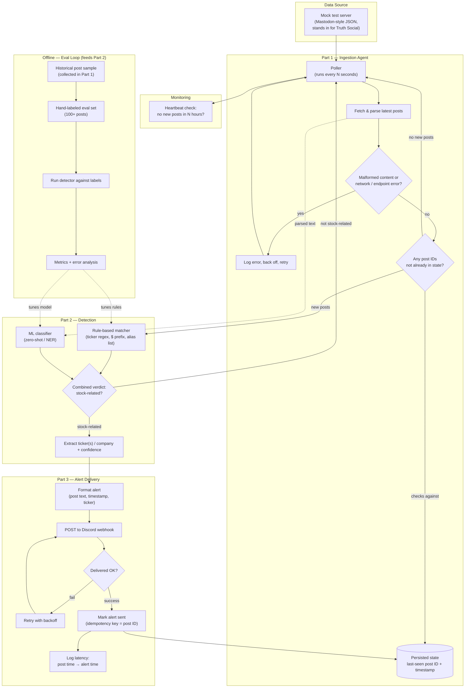

# Documentation

```mermaid
flowchart TD
    subgraph SRC["Data Source"]
        A["Mock test server<br/>(Mastodon-style JSON,<br/>stands in for Truth Social)"]
    end

    subgraph ING["Part 1 — Ingestion Agent"]
        B["Poller<br/>(runs every N seconds)"]
        D[("Persisted state<br/>last-seen post ID + timestamp")]
        E["Fetch & parse latest posts"]
        F{"Malformed content or<br/>network / endpoint error?"}
        G["Log error, back off, retry"]
        C{"Any post IDs<br/>not already in state?"}
    end

    subgraph DET["Part 2 — Detection"]
        H["Rule-based matcher<br/>(ticker regex, $ prefix, alias list)"]
        I["ML classifier<br/>(zero-shot / NER)"]
        J{"Combined verdict:<br/>stock-related?"}
        K["Extract ticker(s) / company + confidence"]
    end

    subgraph ALERT["Part 3 — Alert Delivery"]
        L["Format alert<br/>(post text, timestamp, ticker)"]
        M["POST to Discord webhook"]
        N{"Delivered OK?"}
        O["Retry with backoff"]
        P["Mark alert sent<br/>(idempotency key = post ID)"]
        R["Log latency:<br/>post time → alert time"]
    end

    subgraph MON["Monitoring"]
        Q["Heartbeat check:<br/>no new posts in N hours?"]
    end

    subgraph OFF["Offline — Eval Loop (feeds Part 2)"]
        S["Historical post sample<br/>(collected in Part 1)"]
        T["Hand-labeled eval set<br/>(100+ posts)"]
        U["Run detector against labels"]
        V["Metrics + error analysis"]
    end

    A --> B --> E
    E --> F
    F -- yes --> G --> B
    F -- no --> C
    C -- checks against --> D
    C -- no new posts --> B
    C -- new posts --> H
    E -.parsed text.-> I
    H --> J
    I --> J
    J -- not stock-related --> B
    J -- stock-related --> K
    K --> L --> M --> N
    N -- fail --> O --> M
    N -- success --> P --> D
    P --> R
    B --> Q

    S --> T --> U --> V
    V -.tunes rules.-> H
    V -.tunes model.-> I
```