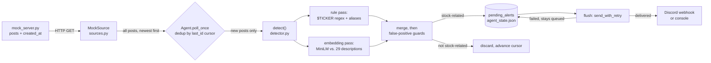

# Truth Social Stock-Mention Alert Agent

A prototype autonomous agent that monitors a social account for posts mentioning publicly traded
companies and delivers an alert to a configurable channel. 

Everything here runs locally. The demo target is `mock_server.py`, a local stand-in for the platform's
API, per the assignment's testing tip. See [Summary of approach](#1-summary-of-approach) for the
investigation into the real source and why it isn't the thing that runs.

---

## Quickstart

```cmd
python -m venv .venv
.venv\Scripts\activate
pip install -r requirements.txt
```

The embedding pass downloads `all-MiniLM-L6-v2` (~90 MB) on first use into `./hf_cache`. After that
first run you can go fully offline:

```cmd
set HF_HUB_OFFLINE=1
```

**Terminal 1 — the mock platform:**

```cmd
python mock_server.py
```

**Terminal 2 — the agent:**

```cmd
python agent.py --poll-interval 5 --alert-channel console
```

For a real end-to-end delivery, swap the channel:

```cmd
python agent.py --poll-interval 5 --alert-channel discord --webhook-url https://discord.com/api/webhooks/...
```

**Terminal 3 — publish a post and watch it come through:**

```cmd
curl -X POST http://127.0.0.1:8000/admin/publish -H "Content-Type: application/json" -d "{\"content\": \"$AMD and $INTC are both moving today.\"}"
```

Or replay a batch from the corpus:

```cmd
python load_test_posts.py
python load_test_posts.py path\to\posts.json
```

**Evaluate the detector against the hand-labeled set:**

```cmd
python eval.py
python eval.py --thresholds 0.20 0.60 0.025
```

**Run the tests** (offline; no model load, no network):

```cmd
python -m pytest -v
```

---

## Repository layout

| File | Role |
| --- | --- |
| `mock_server.py` | FastAPI stand-in for the platform. Serves `GET /api/v1/accounts/{id}/statuses`, accepts `POST /admin/publish`. Persists to `data/posts.json`. |
| `sources.py` | `PostSource` ABC with `MockSource` (used) and `TruthSocialSource` (documented stub). |
| `agent.py` | Entry point. Poll loop, deduplication, state persistence, pending-alert queue, heartbeat monitoring. |
| `detector.py` | Two-pass stock-mention detection: rules + embedding entity linking. |
| `alert_channels.py` | `AlertChannel` ABC, console and Discord webhook implementations, retry/backoff. |
| `eval.py` | Scores `detect()` against `labels.csv`; rule-only vs. rule+embedding, plus a threshold sweep. |
| `data\labels.csv` | 125 hand-labeled posts (the evaluation set). |
| `data\posts_corpus.json` | The 125-post corpus the labels correspond to. |
| `load_test_posts.py` | Republishes corpus content through `/admin/publish` for live runs. |
| `test_*.py` | 28 pytest tests across detection, dedup/state, and delivery retry. |

## Pipeline



---

# Write-Up
 
## 1. Summary of approach
 
### Reading the account without an API
Truth Social is a Mastodon fork and inherits Mastodon's REST shape, including `GET /api/v1/accounts/{id}/statuses`. In October 2024 a contributor to `truthbrush` (maintained at `w2rc/truthbrush`) documented this exact endpoint returning post JSON with zero credentials, using browser-impersonation headers to pass bot detection: [`w2rc/truthbrush#32`](https://github.com/w2rc/truthbrush/issues/32). A January 2026 comment on that issue reported a Cloudflare change had closed it off. I ran a controlled test to check both claims. A bare `requests.get()` with default `python-requests` User-Agent returned a `403` and a blocking HTML page, but an identical request with full browser-impersonation headers (as per the method in the link above) got a `200` response with real posts. Therefore, it appears that the endpoint does accept requests presenting browser-like headers and rejects the Python default. However, whether that is stable or a heuristic that Truth Social could tighten or close at any time is unknown. In July 2026, Truth Social announced an official API endpoint with an undisclosed enterprise cost, which indicates that the company considers there to be significant market value for access.
 
*Candidate 1 — unauthenticated direct read with browser-impersonation headers:* As mentioned above, this currently works, but continued access is unknown and unlikely given the official, paid API endpoint. In addition, rate-limits and ToS breaches are real concerns to work around.

*Candidate 2 — authenticated Mastodon-style client:* Log in with a real Truth Social account and call the same Mastadon-shaped endpoints with valid credentials attached. This is the default approach that `truthbrush` and other scrapers use. It sidesteps guessing bot-detection heuristics, with the existence of the official endpoint, these API calls may become severely restricted in the future.
 
For this project I implemented neither candidate, instead I built an offline imitation server housed in `mock_server.py`. Ingestion is facilitated by a `PostSource` ABC abstract class. The `MockSource` instantiation is what currently runs the `GET` request, but a `TruthSocialSource` is a documented stub with a working one time probe method to illustrate the working browser imitation.

Deduplication is handled by the Agent in `agent.py`. The sources are stateless whereas the agent has a persistent state (stored locally) that uses `last_id` as a cursor with a list of `alerted_ids` that get saved to state atomically after every post and delivery attempt. A persistent queue of `pending_alerts` decouples detection from delivery, so a post that detects but fails to send survives a restart and does not need to be reprocessed. Pending alerts get flushed at a cadence of `flush_interval` which defaults to `poll_interval` if not specified.

### Detection 
Detection is done in two passes which get merged and then filtered. 
1) Rule-based regex and common name scan against a gazetteer, and 
2) Embedding based linking. 

The rule-based pass catches any `$TICKER` mention (independent of gazetteer) and company name or alias that is included in the gazetteer. Bare uppercase tokens are deliberately ignored here to solve the "A"/"IT"/"ALL" problem because Trump in particular is known to use all-caps often. A narrow list of tickers without the `$` prefix is allowed through if they are in the gazetteer and do not collide with listed common word collisions.

The embedding uses the `all-MiniLM-L6-v2` sentence transformer to capture colloquial references to companies that don't use the actual company name. The method compares the vector embedding of the gazetteer against the embedding of the sentence and uses cosine similarity to make a prediction. The model is general purpose and not finely tuned for financial/political text, so it is only as good as the gazetteer in this context.

After both the rule-based and embedding passes, the detector runs through a number of false-positive guards by checking for the presence of various context keywords. If a guard keyword is found, the positive prediction is removed.
 
## 2. Results
 
### Labeled Set and Evaluation
125 posts (generated by Claude Sonnet 5) hand-labeled by me: 57 stock-related, 68 not. The corpus stresses specific failure modes — bare and `$`-prefixed tickers, colloquial references, all-caps word/ticker collisions, homonym traps, generic "stock market" politics, and platform self-references. It's a diagnostic set, not a representative sample. Ambiguous references get one best-guess ticker plus an `alt_candidates` column. Scoring is reported **strict** (primary label only) and **lenient** (accepting alternates). Ticker scores are set-valued, so they use TP/FP/FN only. Evaluation in `eval.py` sweeps across a range of thresholds and reports the optimal threshold in terms of a combined f1 score.

### Performance
 
| Configuration | Bin. P | Bin. R | Bin. F1 | Tkr P (strict) | Tkr R (strict) | Tkr F1 (strict) | Tkr F1 (lenient) |
| --- | --- | --- | --- | --- | --- | --- | --- |
| Rule-based only | 1.000 | 0.737 | 0.848 | 1.000 | 0.734 | 0.847 | 0.847 |
| Rule + embedding, τ=0.35 | 1.000 | **0.912** | **0.954** | 0.704 | 0.891 | 0.786 | 0.811 |
| Rule + embedding, τ=0.45 | 1.000 | 0.842 | 0.914 | **0.929** | 0.812 | **0.867** | 0.876 |
 
Clearly, the ML component is a valuable addition: binary recall 0.737 → 0.912, F1 0.848 → 0.954. Threshold values pose a meaningful trade-off. τ=0.35 is the best threshold in the range for the binary decision and among the worst for ticker precision; τ=0.45 is `eval.py`'s reported optimal threshold and inverts that. **I overrode that and shipped 0.35**. A missed post is a silent failure the user never learns about, potentially missing out on an investment opportunity. The alert always includes the full text of the post and the predicted ticker list, therefore a user can read the alert and decide for themselves. The cost of a false positive is an extra notification.

### Error analysis 

At the shipped threshold only **5 binary misclassifications** remain, in two clean categories: *deliberate bare-ticker exclusions* (#19 `BA`, #25 `KO`) which is the predicted cost of refusing bare two-letter all-caps tokens; and *account identity/context required* (#43 "my social media company", #119/#122 "this platform"), unreachable from post text alone, this is a missing feature, not a model failure. The rule only pass is not able to detect the *colloquial reference* failure point, but in this corpus the embedding completely absorbed these failures. The corpus contains nine colloquial posts, all of which the embedding captured. Of those, there were errors in the ticker prediction but this is largely due to an insufficient gazetteer.
 
Two findings surfaced only through evaluation. **A false-positive guard causing a false negative:** `_is_fruit_context` used a substring test, so `"ate"` matched inside "p**ate**nt" and suppressed "Apple Inc. is facing another lawsuit over patent claims". All guards now use word-boundary regex. Rule-only F1 went 0.725 → 0.848 with this change along with the bare-ticker allowlist. 
 
### Latency

I measured `created_at` → `delivered` against a live Discord webhook at `--poll-interval 5` (with `flush-interval` defaulted): 10.89 s cold for the first post, then 6.07–6.44 s (mean 6.21 s) warm. Despite the ~6s report, warm detection is **~13 ms/post** and webhook delivery **~200 ms**, the remaining ~5.9 s is waiting for the next poll. Latency is therefore almost entirely `poll_interval`. Roughly `poll_interval/2 + 1.3 s` is typical, with `poll_interval + 1.3 s` as worst case. The cold start is the one-time model load, which is why the embedder is `lru_cache`-d. In production the interval trades latency against ban risk: 30 s is 2,880 requests/day per account, 60 s is 1,440. I would run 15–30 s with jitter.
 
## 3. Robustness & ethics
 
The method that runs is not fragile, because it's local. An authenticated client breaks in three distinguishable ways: auth flow changes (loud), schema changes (quiet), and silent rate-limiting or shadow restriction (invisible: polls keep succeeding and return stale data). That last case is why the agent tracks **two independent signals**: an *ingestion heartbeat* (has a poll succeeded recently?) and a *quiet-account* signal (have we seen a new post recently even though polls succeed?). The second catches silent breakage. Both are currently implemented as log-only. `poll_once()` separates connection errors, HTTP errors and malformed JSON, backs off exponentially to a 300 s ceiling, and skips malformed posts rather than aborting the batch. Recovery needs no intervention: cursor and alert state persist, so a restart resumes without reprocessing or double-alerting.
 
**Legal/ToS.** The path that currently works is anonymous, and requires spoofing headers to pass bot detection, which sidesteps agreeing to a ToS by logging in. Header spoofing to defeat access controls is itself commonly prohibited even for otherwise-public data. Proper auth and spoofed headers both have legal complications. The first forces you into ToS complications and the latter risks bot-detection rules. In addition, it is unknown for how long either path will remain available. Mitigations here are cheap: conservative polling with jitter, honouring `429`/`Retry-After` (which is already implemented in delivery), and not redistributing content beyond the alert.
 
**On the product.** Turning a head of state's posts into low-latency trade signals isn't a neutral exercise, and detection errors here are asymmetric, as described above. This reinforces the decisions made in the project: alerts carry the full text post, the detector never invents matches outside of a curated set, and nothing is automated downstream of the alert.
 
## 4. Limitations & next steps
 
**Recall is hard-capped by gazetteer coverage.** The embedding pass extends *how* a company can be named, not *which* companies exist. The fix is SEC EDGAR's `company_tickers.json` (~10k issuers, authoritative, free) joined to Wikidata for aliases. However, at 10k entries, brute-force cosine against every description stops being viable. The architecture would then become candidate generation (NER for company-shaped spans) plus embedding-based entity linking against a vector index in addition to what currently exists. Separately, passing the monitored handle into `detect()` would provide the context needed to resolve the "my platform" self-references behind the other three misses.
 
**Scaling to multiple accounts.** The current loop is single-threaded and would serialize. One known consequence is that a large backlog under sustained rate limiting can delay a due poll. I'd run one lightweight poller per account feeding a shared work queue consumed by a pool of detector workers. State keys on account, but the model instance is shared, so per-account marginal cost stays near the ~13 ms/post figure instead of adding a model load each, and polls stagger to smooth request volume.
 
**Evaluating detection quality in production without hand-labeling.** The cheapest option is to use regex to parse for `$` prefixed tickers, then simply trim the `$` and check whether the pipeline recovers the ticker on its own. This gives a stream of labels that keeps itself current automatically. A second option is checking both passes for agreement. The system already labels this. When a post is flagged by both passes that is a signal that it is almost certainly correct. Posts that only get flagged by one pass should get reviewed by a human but that would significantly cut down the manual labelling. A third method would be to monitor alert volume per ticker agains a rolling baseline. Anomalies here could signal system degradation.
